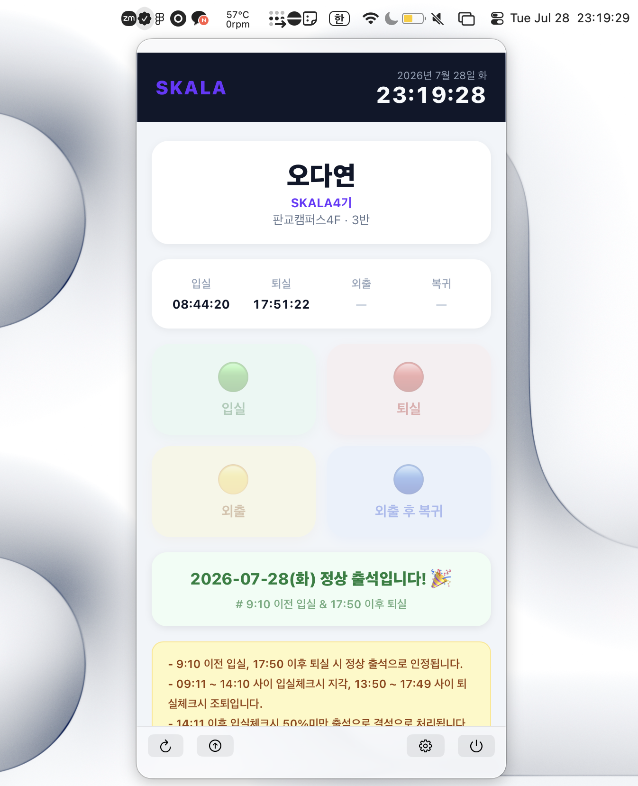

# SKALA Attendance

SKALA Attendance는 macOS 메뉴바에서 SKALA 출결 페이지(`https://att.skala-ai.com/`)를 모바일 화면으로 여는 오픈소스 편의 도구입니다.

## 실행 화면

<p align="center">
  
</p>

## 비공식 앱 고지

SKALA Attendance는 SKALA 또는 SK AX가 제공하는 공식 애플리케이션이 아닌 독립적인 오픈소스 편의 도구입니다. 이 앱은 출결을 자동 처리하지 않습니다. 공식 웹페이지를 모바일 환경으로 열어주며 최종 입실·퇴실 동작은 사용자가 직접 수행합니다.

## 작동 방식

1. 메뉴바의 SKALA Attendance 아이콘 클릭
2. 메뉴바 패널에서 모바일 출결 페이지 확인
3. 사용자가 페이지에서 직접 로그인 및 입실·퇴실 처리
4. 하단 아이콘으로 새로고침, 업데이트 확인, 익명 사용 통계 설정 또는 앱 종료

앱은 WKWebView를 사용해 출결 페이지를 표시하며 로그인 상태를 기기에 유지합니다.

## 기술 스택

- Swift / SwiftUI
- macOS MenuBarExtra (`.window`)
- WKWebView (mobile content mode + Android Chrome UA)
- 영속 WKWebsiteDataStore (로그인 상태 유지)

## 요구사항

- macOS 14.0 이상
- Apple Silicon arm64

## 빌드

```bash
xcodegen generate
xcodebuild build -project SKALAAttendance.xcodeproj \
  -scheme SKALAAttendance \
  -configuration Release \
  -destination 'platform=macOS,arch=arm64'
```

## 라이선스

MIT License. [LICENSE](LICENSE) 파일을 참고하세요.
